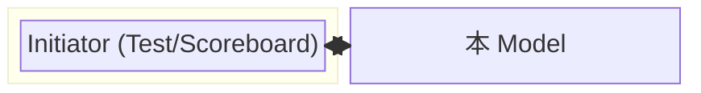
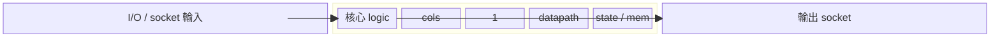
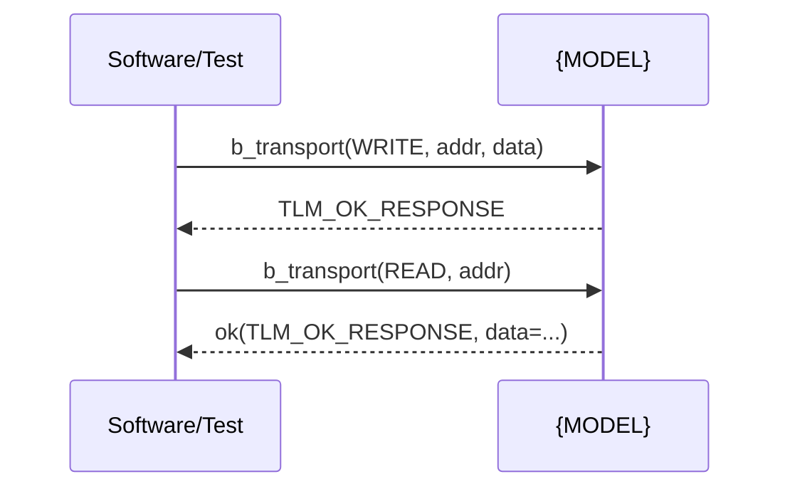
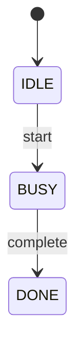
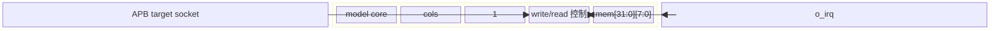
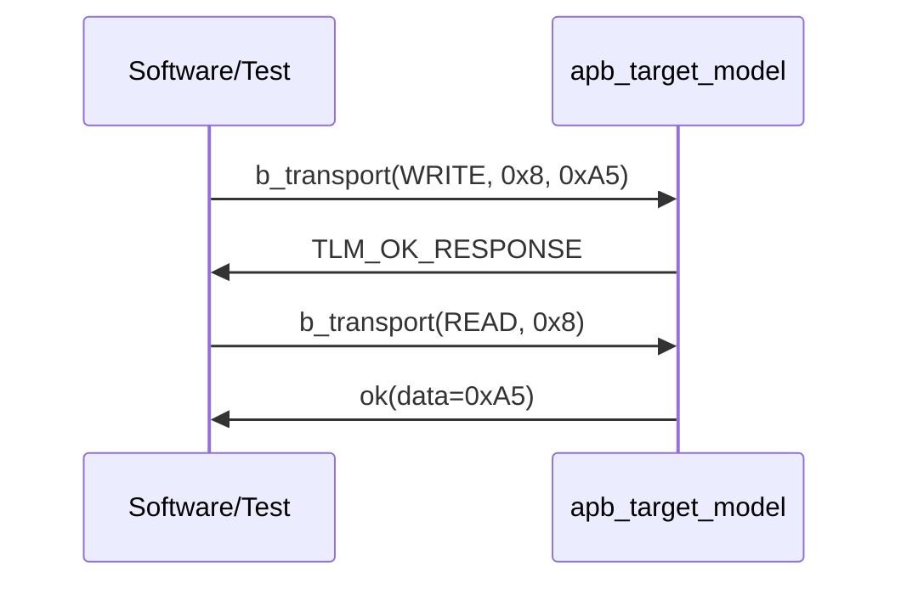

# {MODEL_NAME} TLM Functional Model 文件

> 依 `~/.claude/rules/hardware-arch.md`。**functional behavioral model 為主**，不寫 RTL
> （pipeline/clock/power 不適用；register 為 software 可見面）。
> Section 順序＝讀者閱讀順序：Overview → 設計原因 → Block Diagram → Flow → 時序圖 →
> (FSM，optional) → Interface → Register → Config/Result → 行為細節。

## 1. Scope

一句話：這是 **[模組/feature 名稱]** 的 functional model，涵蓋 **[交易類型/行為]**，明確排除
**[非本文件範圍]**。

## 2. Overview

2–3 句：此 model 提供什麼 transaction 服務、用途（golden reference／BFM／stub）、放系統哪個位置。



## 2.1 設計原因（Why / Design Rationale）

為什麼要這支 model／為什麼用這個行為方式／取捨：
- 【要達成的目的：例如當 golden reference、省 simulation 時間、可執行 spec】
- 【與真硬體/其他實作的取捨：如不做 timing 以換純行為正確、簡化後會失去什麼】
- 【若未來可能改成什麼（已知限制）】

## 3. Block Diagram（內部結構分解）

展示 model 內部組成分解（sub-block／主要模組間如何連接）。單一模組可標核心 storage／介面／邏輯。



## 3.1 Flow / Decision Tree（行為流程圖）

> 對所有讀者最親民的「一圖看懂」：收到交易 → 依條件分流 → 回什麼。**完全不懂的人先看這張，
> designer 對照 Behavior 段。** 用 `flowchart`（有條件分支）或 `decision tree`（純決策）。

```mermaid
flowchart TD
  A[收到 transaction] --> B{op 是?}
  B -- WRITE --> C{addr 越界?}
  C -- 否 --> D[mem[word]=data]
  D --> Z[回 TLM_OK_RESPONSE]
  C -- 是 --> E[不改狀態]
  E --> Y[回 TLM_ADDRESS_ERROR_RESPONSE]
  B -- READ --> F{addr 越界?}
  F -- 否 --> G[回 data = mem[word]]
  G --> Z
  F -- 是 --> E
  Y --> H[結束]
  Z --> H
```

（無明顯分支則一段**線性流程**即可：這裡就是要讓非技術讀者一眼看懂 model 行為。）

## 3.2 時序圖（Transaction Sequence Diagram）

關鍵交易的 initiator↔model 交互走查（LT／AT）。



## 3.3 FSM（optional）

> 僅當 model 有明顯狀態機時填寫；純行為、無 FSM 的 model 可省略本節。



## 4. Interface

**I/O 資料介面（model 代表的硬體介面）：**
| 名稱 | 方向 | 型別/寬度 | Clock 域 | 說明 |
|------|------|-----------|----------|------|
| 【ex. i_data】 | input | uint32 | core | 【】|

**TLM 交易介面（LT/AT、socket、交易方向）：**
- 交易型態：LT（`b_transport()`）／ AT（`nb_transport_fw/bw()`）／ 純
- Socket／port／transaction 方向與負載
- AT 用 `peq_with_cb_and_phase`、payload pooling（`tlm_mm_interface`）(如用)
- 介面接受/發出哪些 transaction、回傳什麼：**此為行為合約**

## 5. Register Map（software 存取的 register 建模；無則拼「—」）

| Field | Offset | R/W | 存取副作用（行為） | Reset | 說明 |
|-------|--------|-----|--------------------|-------|------|
| 【ex. CTRL.enable】 | 0x0 | W | 寫 1 啟動 model | 0 | 【】 |

> functional model 常需模仿真硬體 register，供 software 驅動並與硬體比對。

## 6. Config / Setting Example and Result

如何設定 model（register 寫入／參數），以及設完後的預期結果。**讓讀者可直接照做、照驗**。

```text
Setting:
  1. 寫 CTRL.enable = 1         // 啟動
  2. 寫 CFG.mode = 2            // 切模式
Expected result:
  - 讀 STAT.ready == 1
  - 後續 WRITE 成功回 OK
  - 越界 WRITE 回 error 且不改狀態
```

## 7. Functional Data Model

**交易型別（transaction / data object）：**
| 欄位 | 型別 | 寬度/範圍 | 說明 |
|------|------|-----------|------|
| 【transaction 欄位...】 | | | |

**Functional State（model 內部語意狀態）：**
| State | 型別 | 說明 |
|-------|------|------|
| 【ex. buffer、mode、counter】 | | |

## 8. Behavioral Semantics

對每個 incoming transaction 描述「輸入 → 狀態變化 → 輸出」。以條列或偽碼寫。

```text
on <transaction T>:
    if T.op == WRITE:
        state.buf[n] = T.data
        state.count = state.count + 1
        respond OK
    elif T.op == READ:
        respond OK(data = state.buf[head])
        state.head = (head + 1) ...
    # boundary / error cases
```

## 9. Timing Model

- 近似 latency / `delay` 基準：**【如已知】** ／ 不建模時間（pure-functional）
- AT phase 序列（若 AT）：`BEGIN_REQ → ... → END_REQ`

## 10. Concurrency / 同步

- 【thread 喚醒與同步：event／mutex／queue】 ／ 單執行緒順序

## 11. Assumptions / Deviations

- 對真硬體的簡化 / 假設：**【至少一條，不空白】**
- TBD（期限：{YYYY-MM-DD}）：

## 12. Limitation

- model 目前具體做不到什麼／未涵蓋的能力：**【至少一條，不空白】**

---

# 完整範例（對照填：APB 目標之 TLM functional model）

> 展示 TLM functional 文件的 reader-friendly 密度。照「Overview→設計原因→Block Diagram→
> Flow→時序圖→Interface→Register→Config/Result→細節」順序，重點是讓讀者先懂能做什麼、
> 再懂怎麼用。

```markdown
---
title: apb_target_model Functional Model
status: Draft
date: 2026-08-02
---

# apb_target_model 文件

## 1. Scope
「apb_target_model」是一個 **APB slave 的 TLM functional model**，提供 **LT read/write
交易服務**，做為 software 的 golden reference；明確排除 **AT 交易、錯誤回復、power 建模**。

## 2. Overview
CPU/tb 以 LT 對本 model 寫資料與讀回。model 以 32-word 記憶體為 functional state，做為
golden 期望值來源。**不建模週期時間**（pure-functional），求快、可當 executable spec。

## 2.1 設計原因
- 目的：software 的 golden reference，驗證時拿 model 期望值比對 RTL。
- 取捨：捨 timing 換純行為、可重用於多場景；**若改用有 delay 才需描述 latency**。

## 3. Block Diagram（內部結構）


## 3.1 Flow（決策樹，給非技術讀者）
```mermaid
flowchart TD
  A[收到 transaction] --> B{op 是?}
  B -- WRITE --> C{addr < 4*31 ?}
  C -- 是 --> D[mem[word]=data]
  D --> Z[回 TLM_OK_RESPONSE]
  C -- 否 --> E[不改狀態]
  E --> Y[回 ADDRESS_ERROR]
  B -- READ --> F{addr < 4*31 ?}
  F -- 是 --> G[回 data=mem[word]]
  G --> Z
  F -- 否 --> E
```

## 3.2 時序圖（transaction 走查）


## 3.3 FSM
（本例無 FSM。）

## 4. Interface
**I/O 資料介面：**
| 名稱 | 方向 | 型別/寬度 | Clock 域 | 說明 |
|------|------|-----------|----------|------|
| i_pclk | input | 1 | pclk | APB clock |
| i_paddr | input | uint32 | pclk | APB 位址 |
| i_pwdata | input | uint32 | pclk | APB 寫資料 |
| o_prdata | output | uint32 | pclk | APB 讀資料 |
| o_irq   | output | 1      | pclk | 中斷輸出 |

**TLM socket：**
- 單一 target socket，LT；接受 WRITE/READ。
- 回傳 `TLM_OK_RESPONSE`／越界 `TLM_ADDRESS_ERROR_RESPONSE`。

## 5. Register Map
| register | Offset | R/W | Access 副效用 | Reset | 說明 |
|----------|--------|-----|--------------|-------|------|
| CTRL.enable | 0x0 | W | 寫 1 清空並啟動 | 0 | 主使能 |
| CFG.freq    | 0x4 | RW | 記住後用於分頻 | 0 | 取捨用配置 |
| DATA | 0x8 | W | 寫入 mem[word(addr)] | — | 資料寫入點 |
| irq_status  | 0x10 | RO | 讀回後清 0 | 0 | 中斷狀態（可讀比對）|

## 6. Config / Setting Example & Result
```text
Setting:
  寫 CTRL.enable = 1 → 清空并進入 ready
  寫 CFG.freq = 1    → 啟用除頻
  寫 DATA = 0xA5 @0x8 → 存 mem[1]=0xA5, 回 OK
Expected result:
  讀 DATA @0x8 → 0xA5（golden 比對）
  讀 irq_status → 恰好反映中斷（回比對 *)
```

## 7. Functional Data Model
| 欄位 | 型別 | 寬度 | 說明 |
|------|------|------|------|
| address | sc_uint | 32 | 位址 |
| data_ptr | uint8* | 32 | 讀寫資料 |
| command | WRITE/READ | 1 | R/W |
| len | sc_uint | 32 | 長度(bytes) |

State：`mem[31:0][7:0]` (uint8) 目標內容、`cfg.freq`。

## 8. Behavior
```
on WRITE:
  if addr >= 4*31 → response = TLM_ADDRESS_ERROR_RESPONSE
  else: mem[word(addr)] = data; response = OK
on READ:
  if addr >= 4*31 → ADDRESS_ERROR
  else: data = mem[word(addr)]; response = OK
```

## 9. Timing Model
不建模時間；delay=0（pure-functional）。

## 10. Concurrency
單執行緒順序執行；無 event/mutex 目前。

## 11. Assumptions / Deviations
- 簡化：不做 write 延遲、不做 power/clock domain。
- 未知（到 2026-08-10 定奪）：多 master 同時寫的 atomicity。

## 12. Limitation
- 單一 target socket，不支援多 master 同時存取。
```

> 填寫提醒：讀者先看 Overview→設計原因→Block Diagram→Flow→時序圖→Interface→Register→
> Config 就能【懂】，Behavior 是讓驗證者可查的細節。
