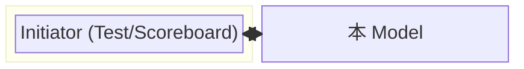
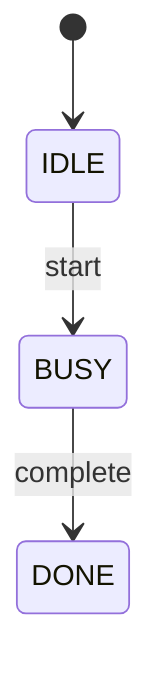

# {MODEL_NAME} TLM Functional Model 架構文件

> 依 `~/.claude/rules/hardware-arch.md`。**functional behavioral model 為主**，不寫 RTL
> （pipeline/clock/power/register map 不適用）。

## Scope

一句話：這是 **[模組/feature 名稱]** 的 functional model，涵蓋 **[交易類型/行為]**，明確排除
**[非本文件範圍]**。

## Overview

2–3 句：此 model 提供什麼 transaction 服務、用途（golden reference／BFM／stub）、放系統哪個位置。



## Functional Data Model

**交易型別（transaction / data object）：**
| 欄位 | 型別 | 寬度/範圍 | 說明 |
|------|------|-----------|------|
| 【transaction 欄位...】 | | | |

**Functional State（model 內部有語意狀態，非 RTL register）：**
| State | 型別 | 說明 |
|-------|------|------|
| 【ex. buffer、mode、counter】 | | |

## Interface

**I/O 資料介面（model 代表的硬體介面）：**
| 名稱 | 方向 | 型別/寬度 | Clock 域 | 說明 |
|------|------|-----------|----------|------|
| 【ex. i_data】 | input | uint32 | core | 【】|

**TLM 交易介面（LT/AT、socket、交易方向）：**
- 交易型態：LT（`b_transport()`）／ AT（`nb_transport_fw/bw()`）／ 純
- Socket／port／transaction 方向與負
- AT 用 `peq_with_cb_and_phase`、payload pooling（`tlm_mm_interface`）(如用)
- 介面接受/發出哪些 transaction、回傳什麼：**此為行為合約**

## Behavioral Semantics

對每個 incoming transaction 描述「輸入 → 狀態變化 → 輸出」。以條列或偽碼寫。

```text
on <transaction T>:
    if T.op == WRITE:
        state.buf[n] = T.data
        state.count = state.count + 1
        respond OK
    elif T.op == READ:
        respond OK(data = state.buf[head])
        state.head = (state.head + 1) ... 
    # boundary / error cases
```

(無明顯狀態機時以行為偽碼表述即達標；有狀態機可另附：)


## Register Map（software 可存取的 register 建模；無則拼「—」）

| Field | Offset | R/W | 存取副作用（行為）| Reset | 說明 |
|-------|--------|-----|--------------------|-------|------|
| 【ex. CTRL.enable】 | 0x0 | W | 寫 1 啟動 model | 0 | 【等】 |

> functional model 常需模仿真硬體 register，讓 software 直接驅動並與硬體比對。

## Timing Model

- 近似 latency / `delay` 基準：**【如已知】** ／ 不建模時間（pure-functional）
- AT phase 序列（若 AT）：`BEGIN_REQ → ... → END_REQ`

## Concurrency / 同步

- 【thread 喚醒與同步：event／mutex／queue】 ／ 單執行緒順序

## Assumptions / Deviations

- 對真硬體的簡化 / 假設：**【至少寫一條，不空白】**
- TBD（期限：{YYYY-MM-DD}）：

---

# 完整範例（對照填：APB 目標之 TLM functional model）

> 展示 TLM functional 文件密度。這是 **functional model 行為規格**——沒有 clock/pipeline/
> register map，重點在 transaction 語意與 model 狀態。

```markdown
---
title: apb_target_model Functional Model
status: Draft
date: 2026-08-02
---

# apb_target_model 架構文件

## Scope
「apb_target_model」是一個 **APB slave 的 TLM functional model**，提供 **LT read/write
交易服務**，做為 software 的 golden reference；明確排除 **AT 交易、錯誤回復、power 建模**。

## Overview
測試環境中，CPU/tb 以 LT transaction 對本 model 寫入資料與讀回。model 以一塊
32-word 記憶體為 functional state，做為 golden 期望值來源。模型不建模週期時間。

## Functional Data Model
transaction（`tlm_generic_payload` 擴充）：
| 欄位 | 型別 | 寬度 | 說明 |
|------|------|------|------|
| address | sc_dt::sc_uint | 32 | 位址 |
| data_ptr | uint8* | 32 | 讀寫資料 |
| command | TLM_WRITE_COMMAND / TLM_READ_COMMAND | 1 | R/W |
| len | sc_uint | 32 | 長度(bytes) |

Functional state：
| State | 型別 | 說明 |
|-------|------|------|
| mem[31:0][7:0] | uint8_t 陣列 | 目標記憶體內容 |
| write_en | bool | 全域寫使能（可改用於控制）|

## Interface
**I/O 資料介面（本 model 模擬的硬體接口）：**
| 名稱 | 方向 | 型別/寬度 | Clock 域 | 說明 |
|------|------|-----------|----------|------|
| i_pclk | input | 1 | pclk | APB clock |
| i_paddr | input | uint32 | pclk | APB 位址 |
| i_pwdata | input | uint32 | pclk | APB 寫資料 |
| o_prdata | output | uint32 | pclk | APB 讀資料 |
| o_irq | output | 1 | pclk | 中斷輸出 |

**TLM 交易介面：**
- 單一 TLM target socket，LT。
- 接受 WRITE/READ command。
- 回傳：`TLM_OK_RESPONSE` ／ 越界 `TLM_ADDRESS_ERROR_RESPONSE`。

## Behavior
on write(read 類似)：
```
function report():
  if t->get_address() >= 4*31:
     t->set_response_status(TLM_ADDRESS_ERROR_RESPONSE)
  else:
     mem[word(t->get_address())] = t->get_data(TLM_WRITE)
     t->set_response_status(TLM_OK_RESPONSE)
  t->execute(TLM_WRITE)
```

（功能以行為為主，無 FSM——本例無狀態機，符合「functional 為要、FSM 可無」。）

## Register Map
| Field | Offset | R/W | 存取副作用 | Reset | 說明 |
|-------|--------|-----|-----------|-------|------|
| CTRL.enable | 0x0 | W | 寫 1 清空且啟動 model | 0 | 主使能 |
| DATA | 0x8 | W | 寫入 mem[word=addr] | — | 資料寫入點 |
| irq_status | 0x10 | RO | 讀回後清 0 | 0 | 中斷狀態（軟體可直接讀比對）|

## Timing
不建模時間（pure-functional）；delay 參數：0。

## Concurrency
單執行緒順序執行；無 event/mutex（如 future 並行加入 point 則需定義同步）。

## Assumptions / Deviations
- 簡化：不做 write-response 延遲、不做 power/clock domain。
- TBD(2026-08-10)：多 master 同時寫入的 atomicity 尚未定案。
```

> 填寫提醒：functional model 文件的「及格水位」核心是 **Behavior** 段——明確「輸入交易 →
> 狀態 → 輸出」的語意，FSM/timing 都是可有可無的表述工具。