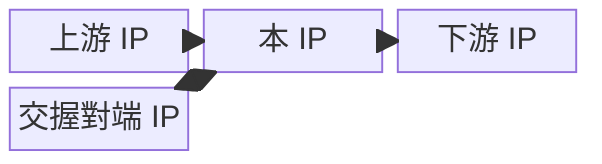
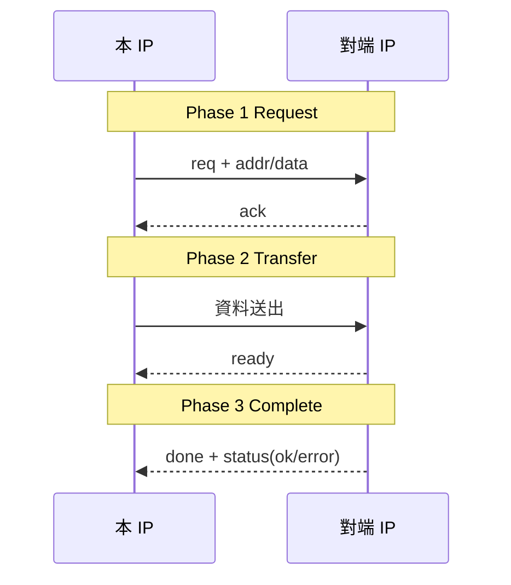

> **領域專屬範本（硬體工程）**：僅需要硬體驗證文件的專案才保留本檔與
> `.claude/rules/hardware-*.md` 家族。複製本模板成新專案時，非硬體專案請直接刪除
> `.claude/rules/hardware-*.md`。

# {FEATURE_NAME} Overview

> 本篇為 **feature 介紹**：讓不懂的人先懂這個 feature 在幹嘛、放哪、跟誰交握、怎麼用。
> 深度行為細節（cycle 級協定、完整 register spec、behavioral model）見 Reference 指向的
> `hardware-arch.md` 等文件。

## Overview

2~3 句話定位：這個 feature 做什麼、在系統哪個位置、主要跟誰互動。
本篇範圍：講 feature 定位與交握概觀。

## Why this feature

為什麼需要這個 feature、解決什麼問題、原本沒它會怎樣。

## Use Case

誰（哪個應用場景）會用到、觸發條件、典型使用流程。

# Block Diagram

## 系統位置（本 IP 在 SoC 中的上下游）



## 內部結構（sub-block）


# Handshake / Interaction

> 本篇核心：本 IP 跟哪些硬體交握、照什麼順序、交換什麼、失敗怎麼辦。

## 交握流程（sequenceDiagram）

> 每個情境一張 diagram：正常、error、timeout 等。



情境清單（照此列，各補一張 diagram）：

| 情境 | 觸發 | 預期行為 |
|------|------|---------|
| 正常完成 | 【】 | 【】 |
| 錯誤（error/NACK） | 【】 | 【】 |
| 超時（timeout） | 【】 | 【】 |

## 周邊模組關係表

| partner | 交握型態 | 啟動者 | 完成條件 | 失敗處理 |
|---------|---------|--------|---------|---------|
| 【對端 IP】 | request/response・streaming | 【誰】 | 【如何判定完成】 | 【timeout/abort/retry】 |

> 本篇為**行為級**，不考慮時序（cycle/pulse/level 不寫）；時序需求屬 arch 文件範圍。

# Interface

## 對外硬體介面

| 名稱 | 方向 | 型別/寬度 | Clock 域 | 說明 |
|------|------|-----------|----------|------|
| 【ex. i_req】 | input | 1 | clk | 【】 |

## 交握介面（handshake 訊號）

| 訊號 | 方向 | type（level/pulse） | 由誰驅動 | 語意 |
|------|------|---------------------|---------|------|
| 【ex. req】 | A→B | level | 【】 | 啟動請求 |

# Register and Configuration

> 粗粒度即可（哪些 register 控制這個 feature、設什麼值開啟）；完整 field/bit 細節指向 arch 文件。

| register | Offset | R/W | 作用 |
|----------|--------|-----|------|
| 【ex. CTRL.enable】 | 0x0 | W | 寫 1 啟動 feature |

# Example

照做的設定步驟＋預期結果。

```text
Setting:
  1. 寫 CTRL.enable = 1
Expected result:
  - 本 IP 與對端 IP 完成交握
  - 讀 STAT.ready == 1
```

# Reference

- 深度行為文件：`{name}_arch.md`（cycle 級協定、behavioral model）
- 【相關 IP 文件、Datasheet、Spec 編號】
